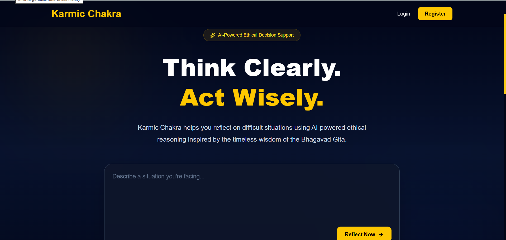
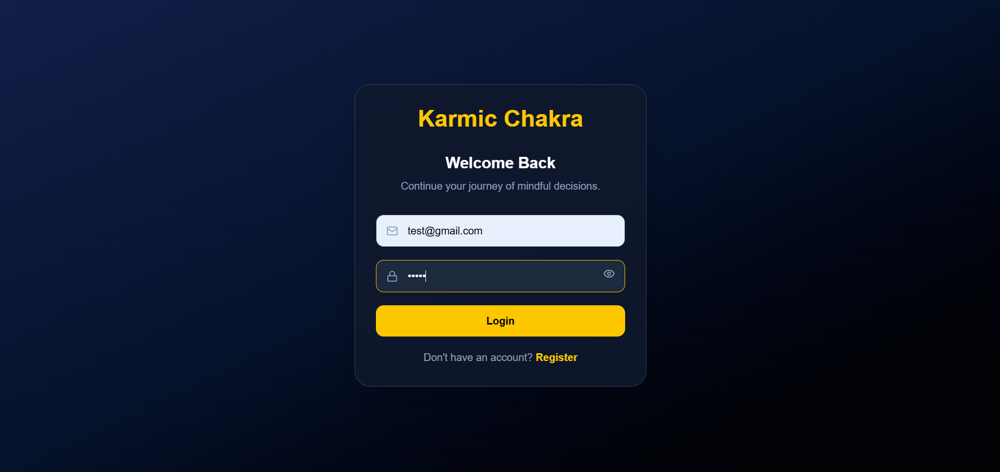
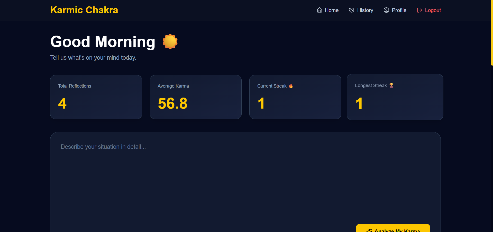
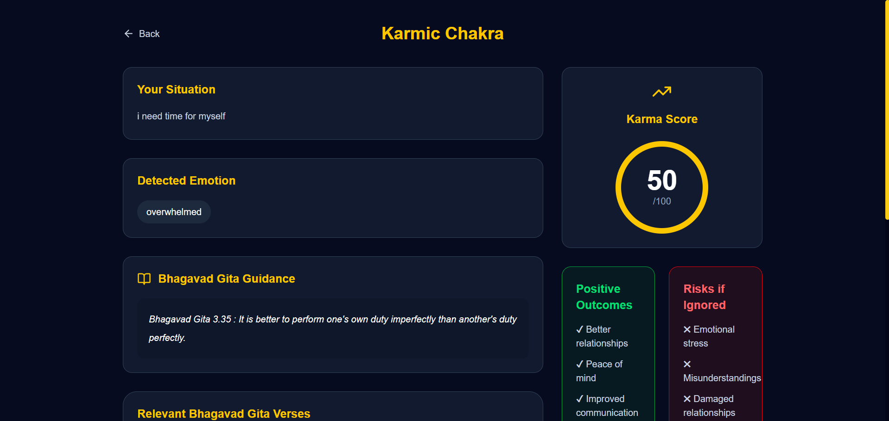
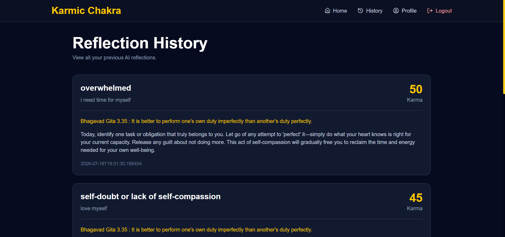

# 🕉️ Karmic Chakra – AI-powered decision intelligence platform inspired by Bhagavad Gita principles.

Karmic Chakra is a full-stack AI-powered web application that helps users reflect on their daily life situations through the teachings of the Bhagavad Gita.

Users can write about any personal situation, and the application uses AI to analyze their emotions, provide relevant Bhagavad Gita verses, assign a Karma Score, and recommend positive actions for self-improvement.

---

## 🌐 Live Demo

🔗 https://karmic-chakra.vercel.app/

---

## 📂 GitHub Repository

🔗 https://github.com/shivangitiwari0411/Karmic-Chakra

---

# ✨ Features

- 🔐 Secure JWT Authentication
- 👤 User Registration & Login
- 🤖 AI-powered Situation Analysis
- 📖 Bhagavad Gita Verse Recommendation
- ❤️ Emotion Detection
- ⭐ Karma Score Generation
- 💡 Personalized Self-Improvement Suggestions
- 📊 Dashboard Analytics
- 📈 Karma Trend Graph
- 🔥 Reflection Streak Tracking
- 📅 Weekly Summary
- 📝 Reflection History
- 📱 Responsive UI

---

# 🛠️ Tech Stack

## Frontend

- React.js
- Vite
- Tailwind CSS
- React Router
- Axios
- Recharts
- Lucide Icons

---

## Backend

- Java 21
- Spring Boot
- Spring Security
- JWT Authentication
- Spring Data JPA
- Hibernate

---

## Database

- MySQL

---

## AI

- OpenRouter API
- DeepSeek Chat Model

---

## Deployment

Frontend:
- Vercel

Backend:
- Render

Database:
- MySQL

---

# 📷 Screenshots

## Home Page



---

## Login



---

## Dashboard



---

## AI Analysis



---

## Reflection History



---

# 📁 Project Structure

```
Frontend/
│
├── src
│   ├── components
│   ├── pages
│   ├── context
│   ├── services
│   └── App.jsx

Backend/
│
├── controller
├── service
├── repository
├── entity
├── dto
├── security
├── config
└── util
```

---

# 🚀 Getting Started

## Clone Repository

```bash
git clone https://github.com/shivangitiwari0411/Karmic-Chakra
```

---

## Backend Setup

Go to backend folder

```bash
cd backend
```

Install dependencies

```bash
mvn clean install
```

Run

```bash
mvn spring-boot:run
```

---

## Frontend Setup

Go to frontend

```bash
cd frontend
```

Install packages

```bash
npm install
```

Run project

```bash
npm run dev
```

---

# ⚙️ Environment Variables

## Backend

Create

```
application.properties
```

Add

```properties
spring.datasource.url=YOUR_DATABASE_URL
spring.datasource.username=YOUR_DB_USERNAME
spring.datasource.password=YOUR_DB_PASSWORD

jwt.secret=YOUR_SECRET_KEY

openrouter.api.key=YOUR_OPENROUTER_API_KEY
```

---

## Frontend

Create

```
.env
```

Add

```
VITE_API_BASE_URL=https://YOUR_RENDER_BACKEND.onrender.com/api
```

---

# 📚 Future Improvements

- AI Chat with Krishna
- Voice Input
- Dark/Light Theme
- Daily Gita Notifications
- Google Login
- Reflection Export as PDF
- Community Reflections

---

# 👩‍💻 Developer

**Shivangi Tiwari**

B.Tech CSE Student

VIT Bhopal University

LinkedIn:
https://www.linkedin.com/in/shivangi-tiwari0411/

GitHub:
https://github.com/shivangitiwari0411

---

## ⭐ If you like this project, consider giving it a star!
